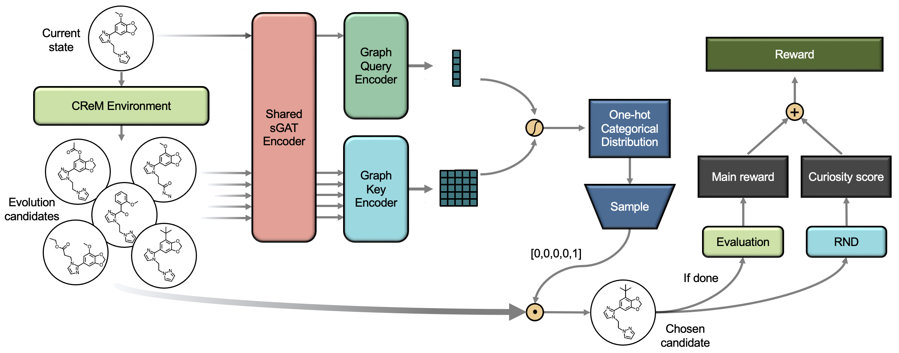

# Distilled Graph Attention Policy Network

This repository is the official implementation of Distilled Graph Attention Policy Network (DGAPN) in the paper [**Spatial Graph Attention and Curiosity-driven Policy for Antiviral Drug Discovery**](http://arxiv.org/abs/2106.02190) (matching branch `iclr`). The implementation of Spatial Graph Attention Network (sGAT) submodule can be found [here](https://github.com/yulun-rayn/sGAT).



```BiBTeX
@inproceedings{wuspatial,
  title={Spatial Graph Attention and Curiosity-driven Policy for Antiviral Drug Discovery},
  author={Wu, Yulun and Choma, Nicholas and Chen, Andrew Deru and Cashman, Mikaela and Prates, Erica Teixeira and Vergara, Veronica G Melesse and Shah, Manesh B and Clyde, Austin and Brettin, Thomas and de Jong, Wibe Albert and others},
  booktitle={International Conference on Learning Representations},
  year={2022}
}
```


## Requirements

#### 1. Set up the Repository
```bash
git clone https://github.com/yulun-rayn/DGAPN
cd DGAPN
git submodule update --init --recursive
```

#### 2. Install Python Dependencies
```bash
conda config --append channels conda-forge
conda create -n dgapn-env --file requirements.txt
conda activate dgapn-env

pip install -e sGAT
pip install crem==0.2.5
```

#### 3. Install Learning Libraries
- [Pytorch](https://pytorch.org/) [**1.11**.0](https://pytorch.org/get-started/previous-versions/)
- [Pytorch Geometric](https://pytorch-geometric.readthedocs.io/en/latest/) [**2.1**.0](https://pytorch-geometric.readthedocs.io/en/2.1.0/notes/installation.html)

  \* *make sure to install the right versions for your toolkit*

#### 4. Install Docking Software (if docking reward is desired)

To evaluate molecular docking scores, the docking program [AutoDock-GPU](https://github.com/ccsb-scripps/AutoDock-GPU/wiki) [**1.5**.3](https://github.com/ccsb-scripps/AutoDock-GPU/releases) ([guideline](https://github.com/ccsb-scripps/AutoDock-GPU/wiki/Guideline-for-users)) and [Open Babel](https://github.com/openbabel/openbabel/wiki) [**3.1**.1](https://github.com/openbabel/openbabel/releases) ([guideline](https://openbabel.org/docs/current/Installation/install.html)) need to be installed. After installations, change `ADT_PATH` and `OBABEL_PATH` in [the score function](dgapn/reward/adtgpu/get_score.py) to the corresponding executable paths on your system.

[The provided resources](dgapn/reward/adtgpu/receptor) are for docking in the catalytic site of NSP15. If docking against a new protein is desired, several input receptor files need to be generated, see [the sub-directory](dgapn/reward/adtgpu) for more details.


## Training

Once the conda environment is set up, the function call to train the DGAPN is:

```bash
./main_train.sh &
```

A list of flags may be found in `main_train.sh` and `main_train.py` for experimentation with different network and training parameters (`--reward_type dock` only if docking software has been set up; different `--run_id` for each task if multiple docking tasks are running at the same time). The run log, models and generated molecules are saved under `*artifact_path*/saves`; the tensorboard log is saved under `*artifact_path*/runs`.

If you wish to produce a pre-trained graph embedding model for DGAPN training, or just want to try out supervised learning with spatial graph attention network, check out `sGAT` for the submodule instructions (installation steps can be skipped if a DGAPN environment is already established).


## Evaluation

After training a model, use `main_evaluate.sh` to produce and evaluate molecules. The flag `--model_path` should be modified to direct to a trained DGAPN model.

```bash
./main_evaluate.sh
```

Generated molecules are saved under `*artifact_path*/*name*` as a csv file, where each line contains a molecule's SMILES string and associated score.


## Pre-trained Models
Trained DGAPN model on docking reward and samples of molecules generated in evaluation can be found [here](https://github.com/yulun-rayn/SGAnCP4ADD).


## License

Contributions are welcome! All content here is licensed under the MIT license.
